# Azure Infrastructure as Code Lab (Terraform)


## Architecture Diagram

Azure Infrastructure as Code Lab (Terraform)
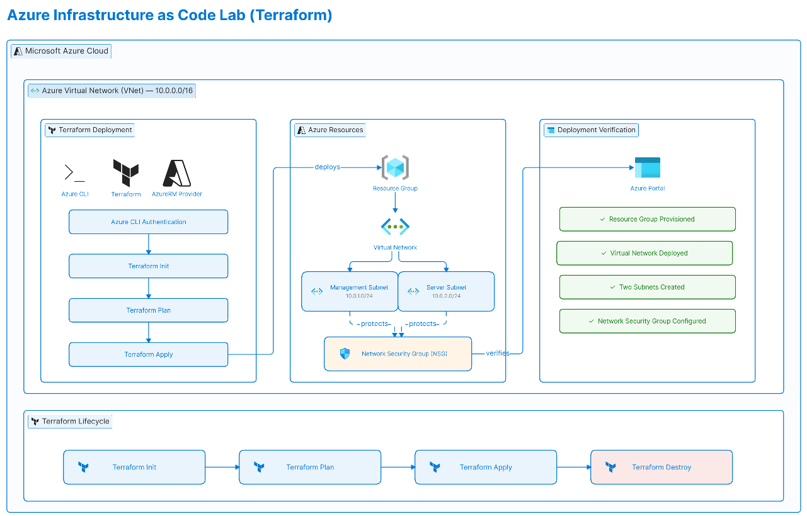

---

# Project Overview

This project demonstrates the deployment and lifecycle management of Microsoft Azure infrastructure using **Terraform** and **Infrastructure as Code (IaC)** principles.

The lab focuses on replacing manual Azure Portal deployments with reusable, version-controlled Terraform configurations that automate Azure networking resource provisioning.

The project follows the complete Terraform workflow from authentication to deployment verification and infrastructure cleanup.

---

# Technologies Used

- Microsoft Azure
- Terraform
- Azure CLI
- Azure Resource Manager (AzureRM Provider)
- Infrastructure as Code (IaC)

---

# Infrastructure Setup

## 1. Azure Authentication

Authenticated Terraform to Microsoft Azure using Azure CLI credentials.

This enables secure access to Azure resources without storing credentials inside Terraform configuration files.

---

## 2. Resource Group Deployment

Created a dedicated Azure Resource Group to logically organize all deployed resources.

This demonstrates:

- Azure resource organization
- logical resource grouping
- infrastructure management

---

## 3. Virtual Network Deployment

Provisioned an Azure Virtual Network (VNet) with the following address space:

```
10.0.0.0/16
```

The virtual network provides isolated cloud networking for deployed resources.

---

## 4. Network Segmentation

Configured two independent subnets.

### Management Subnet

```
10.0.1.0/24
```

Used for administrative resources.

### Server Subnet

```
10.0.2.0/24
```

Reserved for application and server workloads.

This demonstrates:

- subnetting
- network isolation
- Azure networking fundamentals

---

## 5. Network Security Group

Created an Azure Network Security Group (NSG).

The NSG provides a foundation for controlling inbound and outbound traffic using security rules.

This demonstrates:

- network security
- traffic filtering
- Azure security best practices

---

## 6. Terraform Deployment Workflow

Executed the complete Infrastructure as Code lifecycle.

- Terraform Init
- Terraform Plan
- Terraform Apply
- Terraform Destroy

This validates the ability to safely provision, review, deploy, and remove Azure infrastructure.

---

## 7. Deployment Verification

Verified the successful deployment in Microsoft Azure Portal.

Confirmed the creation of:

- Resource Group
- Virtual Network
- Management Subnet
- Server Subnet
- Network Security Group

---

# Skills Demonstrated

- Infrastructure as Code (IaC)
- Terraform
- Azure CLI
- Azure Resource Manager
- Azure Networking
- Virtual Networks
- Network Segmentation
- Network Security Groups
- Cloud Infrastructure Automation
- Infrastructure Lifecycle Management

---

# Learning Outcomes

During this project I gained practical experience with:

- automating Azure infrastructure deployment using Terraform
- replacing manual Azure Portal configuration with Infrastructure as Code
- organizing Azure networking resources using reusable Terraform configuration
- understanding the complete Terraform deployment lifecycle from planning to cleanup
- managing Azure networking resources in a repeatable and version-controlled manner

---

# Screenshots

### 1. Terraform Installation
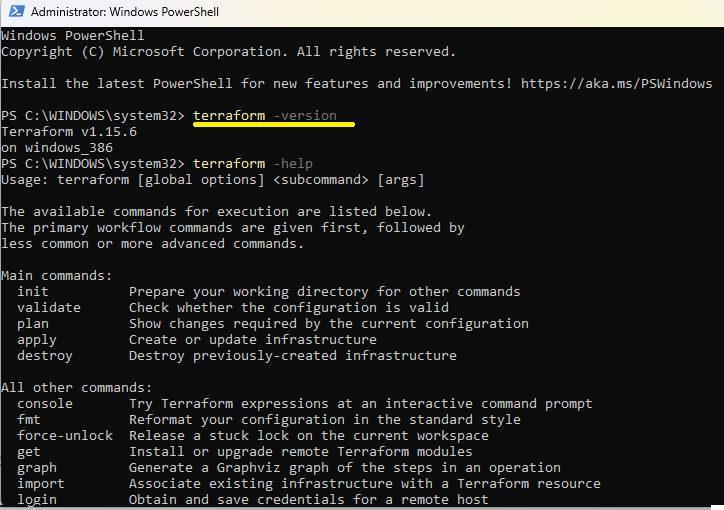
Terraform Version

### 2. Azure Authentication
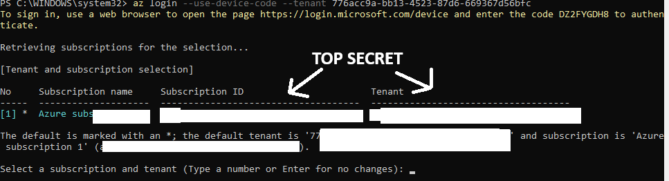
Azure CLI Login

### 3. Project Structure
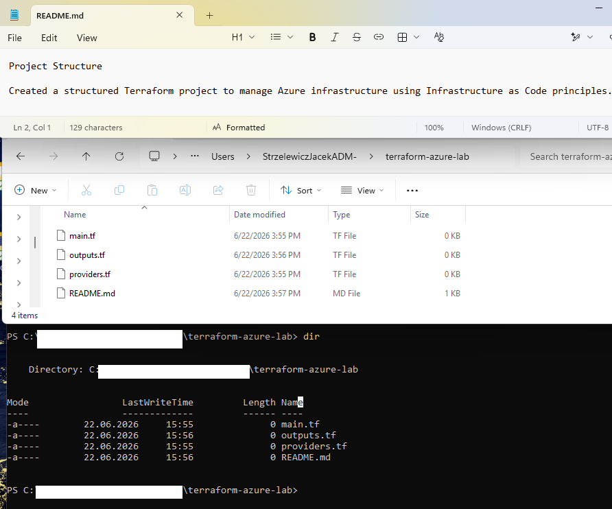
Terraform Project

### 4. Azure Provider Configuration
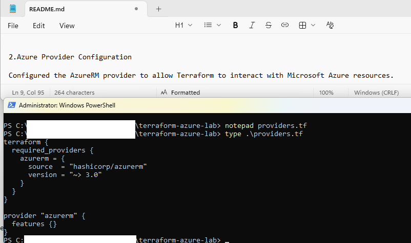
Provider Configuration

### 5. Resource Group
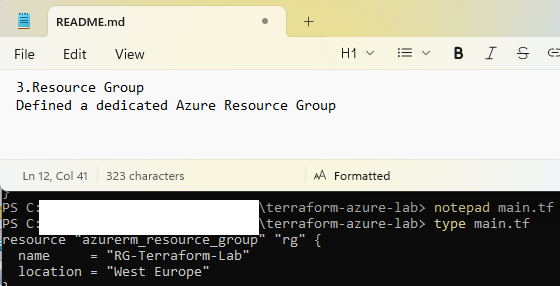
Resource Group Configuration

### 6. Virtual Network
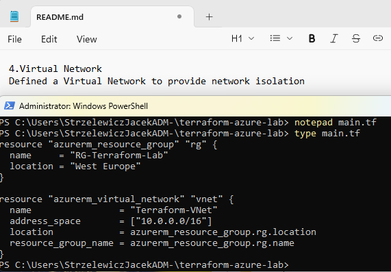
Virtual Network Configuration

### 7. Subnets
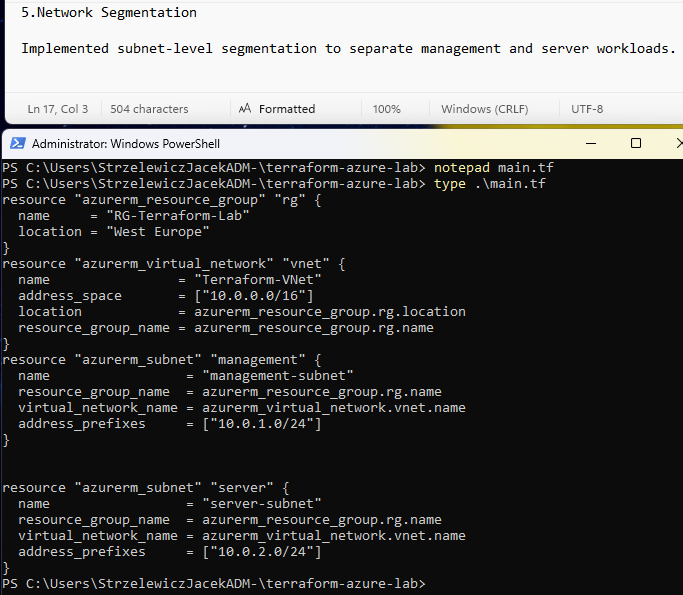
Management & Server Subnets

### 8. Network Security Group
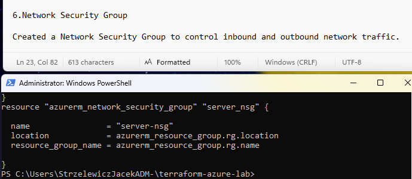
NSG Configuration

### 9. Terraform Initialization
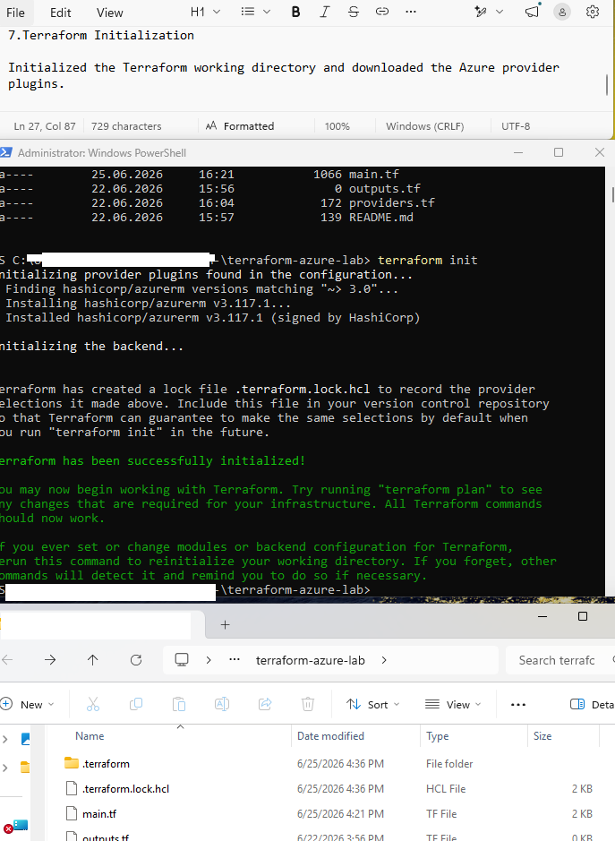
Terraform Init

### 10. Terraform Execution Plan
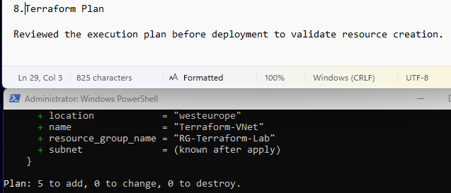
Terraform Plan

### 11. Infrastructure Deployment
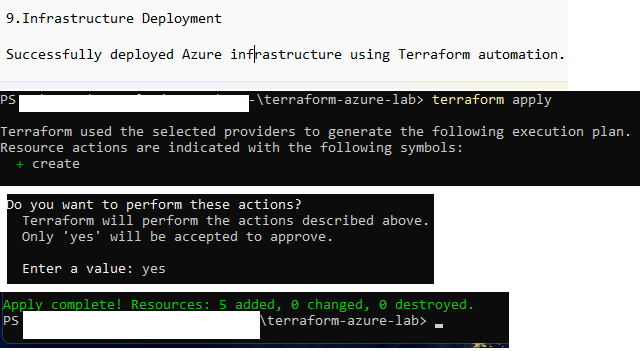
Terraform Apply

### 12. Azure Deployment Verification
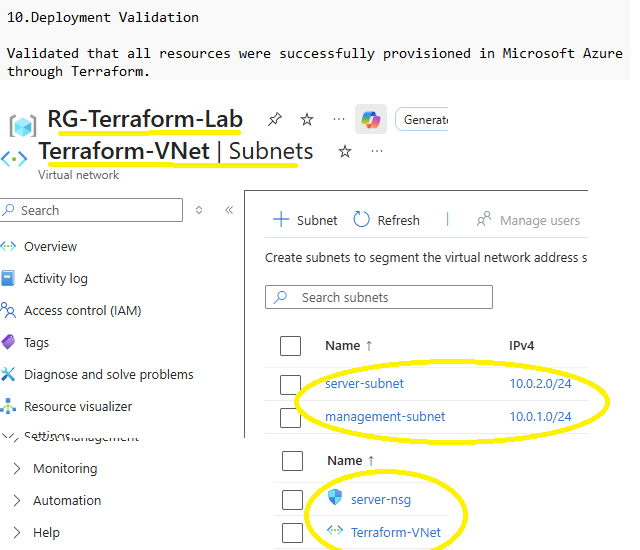
Azure Resources

### 13. Infrastructure Cleanup
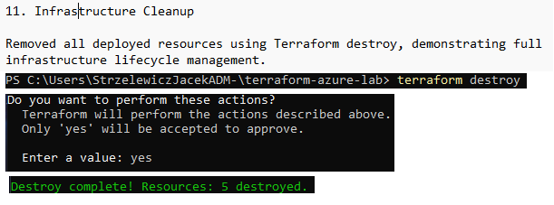
Terraform Destroy

---

# Future Improvements

Possible future enhancements include:

- Deploy Azure Virtual Machines using Terraform
- Configure Azure Bastion for secure remote administration
- Implement reusable Terraform modules
- Manage secrets using Azure Key Vault
- Deploy infrastructure through GitHub Actions or Azure DevOps CI/CD pipelines
- Extend the environment with Azure Load Balancer and Application Gateway
- Apply advanced Network Security Group rules and routing policies

---

# Summary

This project demonstrates the complete Infrastructure as Code deployment lifecycle using Terraform on Microsoft Azure.

The lab covers Azure authentication, networking resource provisioning, deployment verification, and infrastructure cleanup while following Infrastructure as Code best practices.

The project provides a solid foundation for more advanced Azure automation scenarios involving Virtual Machines, Azure Bastion, Ansible, Terraform modules, and CI/CD pipelines.
